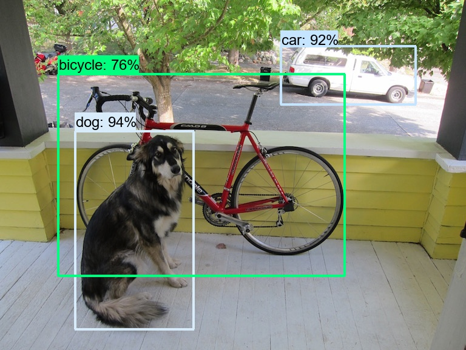

# yolo v3

## 项目目录

```text
｜--data                 配置文件
    |--voc.data            
    |--voc.names           
    |--yolo_v3.cfd         
｜--imgs                 测试图片
    |--xxx.jpg
｜--models_scratch       模型存储路径     
｜--runs                 tensorboardX
｜--camera.py            摄像头实时检测
｜--Darknet.py           yolov3网络
｜--dataset.py           数据预处理
｜--detect.py            预测单张图片
｜--gui.py               图片检测接口
｜--k-means.py           生成anchors
｜--my_eval.py           评估模型   
｜--train.py             训练
｜--utils.py             其他函数
｜--voc_label.py         voc转yolo_label
```

## 数据集准备

- **下载数据集**   
下载VOC数据集

- **生成label**   
运行`voc_label.py`生成相应label

## 训练自己的数据集
- 运行`k-means.py`生成anchors

- 修改`data/yolo_v3.cfg`的配置信息：计算生成的anchors面积，由小到大进行排列填入配置文件
```shell
python train.py
```

## 预测
```text
python detect.py
```

## 评估模型

```text
python my_eval.py
```

## 效果

